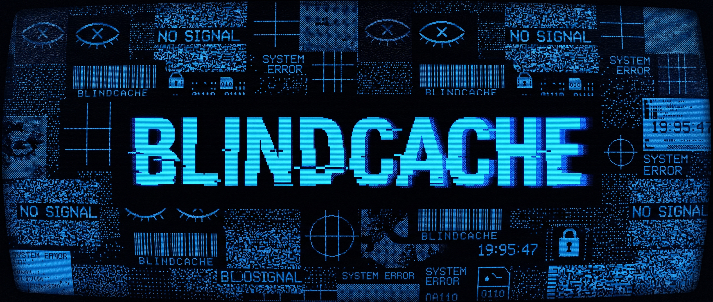

<p align="center">
  
</p>

<h1 align="center">BlindCache</h1>

<p align="center">
  <b>An encrypted memory layer for AI agents, built on Nillion's Blind Computer.</b><br/>
  Sharded across three nilDB nodes. No operator — not even us — can read your content at rest.
</p>

<p align="center">
  <a href="https://github.com/nikshepsvn/blindcache/blob/main/LICENSE"></a>
  <a href="https://github.com/nikshepsvn/blindcache/blob/main/CHANGELOG.md"></a>
  <a href="https://modelcontextprotocol.io"></a>
  <a href="https://nillion.com"></a>
</p>

<p align="center">
  <a href="#quick-start">Quick start</a> ·
  <a href="#tools">Tools</a> ·
  <a href="#background-and-where-nemo-ai-fits-in">Background</a> ·
  <a href="#performance">Performance</a> ·
  <a href="#wire-into-claude-code">Claude Code</a> ·
  <a href="#whats-next">What's next</a>
</p>

---

## Why

Every AI agent today re-asks you for the same context. Mem0, Letta, Zep, ChatGPT memory — all useful, all centralized: the provider can read your plaintext. BlindCache is the same shape (an MCP server exposing `memory_*` tools) but the substrate is Nillion's **Blind Computer**: content is split into Shamir-style shares across three nilDB nodes, and the SDK only ever recombines them on your machine. To the agent, it feels like a normal memory layer. To the operator, it's noise.

## Architecture in one diagram

```
┌──────────────┐    memory_*    ┌──────────────────┐    encrypted shares     ┌──────────────────┐
│ Claude Code  │ ─────────────► │  blindcache-mcp  │ ──────────────────────► │ nilDB node 1     │
│ Cursor       │   stdio / HTTP │   (this repo)    │ ──────────────────────► │ nilDB node 2     │
│ any agent    │ ◄───────────── │                  │ ──────────────────────► │ nilDB node 3     │
└──────────────┘   plaintext    └──────────────────┘    shares re-combine    └──────────────────┘
                                       │
                                       │  optional: auto-tag + summarize
                                       ▼
                                ┌──────────────────┐
                                │   nilAI (TEE)    │
                                └──────────────────┘
```

Plaintext only ever exists inside the MCP process and (briefly, inside an enclave) inside nilAI when auto-tagging is on. Nothing else.

## Background — and where nemo-ai fits in

Before BlindCache, I built **[nemo-ai](https://github.com/nikshepsvn/nemo-ai)** — also an MCP memory server, also "private memory for AI agents," but with a fundamentally different threat model. BlindCache exists because nemo-ai answers one question (*how do I keep memory off the cloud entirely?*) brilliantly but can't answer another (*how do I share that memory across my devices, apps, and — eventually — other people, without trusting any operator?*).

### What nemo-ai is great at

- **Fully local** — SQLite + Ollama, nothing leaves your laptop. Zero cost forever, zero infra, ~10s of ms latency.
- **Sophisticated memory logic** — fact extraction, ADD/UPDATE/INVALIDATE reasoning (e.g. *"I moved to Berlin"* invalidates *"I live in London"*), bi-temporal model (`valid_at` / `invalid_at`), auto-extracted entity graph with temporally tracked edges, multi-factor retrieval scoring with per-result component breakdown, session consolidation that dedups + merges + links.
- **Single-machine privacy** is the strongest possible answer for the use cases it serves: nothing to subpoena, nothing to leak, nothing to trust.

### Where nemo-ai stops

- **One machine only.** Use Cursor on a laptop *and* Claude on a phone *and* ChatGPT in a browser? Your memory is on the laptop. (E2EE sync is on the roadmap; not built.)
- **Single app, single user.** No way for two apps to share the same vault with scoped access; no way for two users to compute over each other's memory without revealing it.
- **No cloud — so no cloud-resistant guarantees.** The privacy story is "the data isn't out there." That works until you need it out there.

### Why BlindCache exists

The same person — me — uses Cursor on a laptop, Claude on a phone, ChatGPT on the web, and would like one memory across all of those. That requires a cloud surface. The moment you put memory in a cloud surface, the question is *who can read it*. nemo-ai's answer ("nobody, because it's not in the cloud") is unbeatable for its use case. BlindCache's answer ("nobody, because it's secret-shared across three operators who'd have to collude to decrypt") is unbeatable for use cases nemo-ai can't reach: cross-device, multi-app, eventually multi-user MPC.

### How this compares to other options

|  | nemo-ai | **BlindCache** | Mem0 / Letta / Zep | ChatGPT memory |
| --- | --- | --- | --- | --- |
| Lives where | Your laptop | Sharded across 3 nilDB nodes | Provider's cloud | OpenAI's cloud |
| Operator can read your content | N/A (no operator) | **No — cryptographic** | Yes | Yes |
| Cross-device | No (roadmap) | **Yes** | Yes | Locked to ChatGPT |
| Multi-app sharing | No | **Yes** (Tier 2: per-doc ACLs) | One app at a time | No |
| Multi-user compute over private data | Architecturally impossible | **Yes** (Tier 2: Nada MPC) | No | No |
| Memory reasoning (contradictions, temporal, etc.) | **Sophisticated** | Basic + optional nilAI summarize | Sophisticated | Black box |
| Retrieval explainability | **Per-result component scores** | None | Partial (varies) | None |
| Latency | **~10s of ms** | ~330 ms | ~100–300 ms | seconds |
| Cost | **$0** | Free tier + NIL burn | $29–99/mo subscription | $20/mo + ChatGPT subscription |

### The honest take

These aren't competing on the same axis. **nemo-ai is the right tool when memory should never leave your machine.** **BlindCache is the right tool when memory has to be reachable across machines and apps but you don't trust any cloud operator.** They occupy different points in the design space.

The most interesting future is **nemo-ai's reasoning layer running on top of BlindCache's encrypted substrate** — local intelligence (ADD/UPDATE/INVALIDATE, contradiction detection, entity graphs) layered over cryptographic persistence (cross-device reach, multi-app scoping, cross-user compute). That's a 1 + 1 = 3. See [What's next](#whats-next).

## Tools

| Tool | What it does |
|---|---|
| `memory_append` | Store one encrypted memory. Auto-tagged via nilAI when configured. |
| `memory_bulk_append` | Up to 200 entries in a single round trip. |
| `memory_search` | Plaintext filters (`tags` / `source` / `scope` / `since` / `before` / cursor) server-side. Optional `query` string runs client-side after decryption. |
| `memory_list` | Recent-first listing, scope-aware. |
| `memory_get` | Fetch a single decrypted memory by id. |
| `memory_update` | Edit content / tags / source / scope of an entry by id. |
| `memory_delete` | Permanent removal by id. |
| `memory_summary` | Pull memories matching a filter, summarize via nilAI. Requires `NILLION_API_KEY`. |

## Quick start

```bash
pnpm install
pnpm smoke          # full CRUD + filters + cursor + update + bulk against testnet
```

That generates an ephemeral builder keypair, registers with Nillion testnet, creates a collection, writes 10 encrypted memories, runs every filter variant, paginates, updates, bulk-inserts, and prints latency. No env vars required.

For persistent memory across restarts, get a real key:

```bash
pnpm keygen         # prints PRIVATE KEY + DID
# paste the key into .env as NIL_BUILDER_PRIVATE_KEY
pnpm build
pnpm dev:mcp        # stdio
```

## Wire into Claude Code

Add to `~/.claude/claude_desktop_config.json` (or a per-project `.mcp.json`):

```json
{
  "mcpServers": {
    "blindcache": {
      "command": "node",
      "args": ["/absolute/path/to/blindcache/packages/blindcache-mcp/dist/server.js"],
      "env": {
        "NIL_BUILDER_PRIVATE_KEY": "your-hex-private-key-here",
        "NILLION_API_KEY": "optional — unlocks auto-tag + memory_summary"
      }
    }
  }
}
```

Restart Claude Code. Your agent now has `memory_*` tools.

## HTTP mode

Run as a local HTTP server multiple agents can share, instead of spawning a new stdio process per agent:

```bash
BLINDCACHE_HTTP_PORT=3737 BLINDCACHE_HTTP_TOKEN=$(uuidgen) pnpm dev:mcp
# health: curl http://127.0.0.1:3737/health
# mcp:    POST http://127.0.0.1:3737/mcp  with `Authorization: Bearer <token>`
```

`BLINDCACHE_HTTP_TOKEN` is required — the server refuses to listen otherwise.

## Switching from testnet to mainnet

Testnet is permissive — write all you want, no payment. Mainnet is the real, decentralized network: four nodes operated by Nillion, PairPoint, STC Bahrain, and Deutsche Telekom MMS. To flip:

**1. Subscribe via the developer portal.** Open [`portal.nillion.com`](https://portal.nillion.com), connect a Keplr wallet, and subscribe to nilDB. Both nilDB and nilAI have a free tier; beyond it you burn NIL → credits → assign to specific nodes. The portal walks you through it; no email or credit card required.

**2. Point `NILDB_NODES` at the mainnet cluster.** Override the env var (default is testnet):

```bash
NILDB_NODES="https://nildb-5ab1.nillion.network,https://nildb-f496.pairpointweb3.io,https://nildb-f375.stcbahrain.net,https://nildb-2140.staking.telekom-mms.com"
```

**3. Use the builder key the portal generated.** Set `NIL_BUILDER_PRIVATE_KEY` to the key from your subscription — that's the DID the network knows you by.

**4. Re-run.** Nothing else changes. Same SDK, same MCP tools, same code. The collection auto-creates on first call; new builder = new vault.

> Migration note: there is no automatic data migration from testnet to mainnet. Treat testnet as scratch space.

## Performance

Numbers from `pnpm smoke` against `nildb-stg-n{1,2,3}.nillion.network` — measured **from Southeast Asia (India) while traveling**, talking to a US/EU staging cluster. The numbers below are with that ~250 ms baseline round-trip already baked in. Closer to the nodes, expect roughly half this.

| Operation | Latency |
|---|---|
| `vault.open()` (one-time) | 3-5 s |
| `append` median / p95 | ~335 ms / ~1.2 s |
| `bulkAppend(5)` | ~370 ms |
| `update` (re-encrypt + write) | ~600 ms |
| `search` (scope filter) | ~330 ms |
| `search` (query + scope) | ~320 ms |
| `search` (time-range) | ~310 ms |
| `search` (cursor page) | ~315 ms |
| `delete` | ~315 ms |
| `summarize` (nilAI) | requires `NILLION_API_KEY` |

Decryption round-trip is verified end-to-end in the smoke test.

## Auto-tag and summarize (nilAI)

If `NILLION_API_KEY` is set, every `memory_append` is augmented with 2-5 LLM-suggested topical tags via [nilAI](https://docs.nillion.com/blind-computer/build/llms/quickstart) — an OpenAI-compatible endpoint that runs the model inside a Trusted Execution Environment. The same key unlocks `memory_summary` for digesting filter results.

```
"Pair-programmed with Maya on Stripe webhook retry logic…"
  → [stripe, webhooks, retry-logic, maya]
```

> **Privacy trade-off, named honestly:** nilAI is TEE-based, not MPC. Plaintext is briefly visible to the model inside the enclave during inference. The vault itself remains MPC-encrypted at rest. If your threat model requires that no Nillion infrastructure ever sees plaintext, leave `NILLION_API_KEY` unset and tag manually.

## Repo layout

```
packages/
  blindcache-core/   Vault wrapper over @nillion/secretvaults — CRUD, bulk, summarize, auto-tag
  blindcache-mcp/    MCP server (stdio + HTTP) exposing memory_* tools
scripts/
  fix-libsodium.mjs  Postinstall workaround for an upstream libsodium ESM packaging bug
docs/
  banner.jpg         The wallpaper above
```

## Gotchas (so the next person doesn't waste a day)

<details>
<summary>Click to expand the list of things I burned a day on</summary>

1. **Schema root must be `type: "array"` with `items`** — root `type: "object"` is rejected as `"must be object"` because nilDB validates the whole batch, not each record.
2. **`Signer.getDid()` returns a `Did` object, not a string** — use `.didString`. `.toString()` returns `[object Object]` and registration fails with `"Token subject does not match registration DID"`.
3. **libsodium-wrappers-sumo ESM build is broken on pnpm** — its build references `./libsodium-sumo.mjs` which actually lives in the sibling `libsodium-sumo` package. `scripts/fix-libsodium.mjs` symlinks it on `pnpm install`.
4. **Plaintext-only updates fail under blindfold** — the SDK's blindfold layer expects every write body to contain a `%allot` field so it can fan out into one share per node. We always include `content` (re-fetched if not changing) to keep blindfold happy. Cost: one extra read per update.
5. **Collections are immutable** — bumping the schema (e.g. adding `scope` in v2) requires a new collection. Existing entries in older collections stay queryable under their old schema; just don't expect cross-version writes.
6. **One bad node breaks reads** — the SDK retries 5× per node on transient errors, but if one node is permanently down, `findData` throws (no 2-of-3 fallback yet). Bypassing this requires forking the SDK.

</details>

## What this proves

- Nillion testnet works headlessly. No MetaMask, no browser. `pnpm keygen` + `pnpm smoke` is enough.
- Sub-500ms encrypted writes / reads from a US laptop to a 3-node staging cluster.
- The full CRUD + filter + paginate + bulk + summarize loop runs end-to-end.
- An MCP server is a viable distribution channel — the vault feels like a normal `memory.*` to the agent; the encryption is invisible.

## What's next

Two parallel tracks. **Tier 2** is the Nillion-native differentiation; **the nemo-ai integration** is the 1 + 1 = 3 with the [prior project](#background-and-where-nemo-ai-fits-in).

### Tier 2 — primitives nothing else can build

- **Owned collections + per-document ACLs** → user owns vault, multiple apps coexist with scoped access.
- **OAuth-shape scope handoff** → third-party apps request scoped delegation tokens; user approves via a dashboard. Plaid Link, but for memory.
- **Cross-user compute (Nada)** → first MPC program: shared tag overlap between two users, neither sees the other's tags. The viral demo.
- **Encrypted semantic search (Nada)** → top-k over encrypted embeddings, server-side.
- **Field-level disclosure** → an app reads `tags` but not `content`.
- **2-of-3 read tolerance** → fork the SDK's cluster fanout so one missing node doesn't kill reads.
- **Lit Protocol PKP identity** → passkey-based identity, multi-device, social recovery.

### nemo-ai + BlindCache integration

A separate adapter package (`nemo-blindcache` or an example in either repo) that lets nemo-ai's reasoning layer use BlindCache as its persistence backend. Concretely:

- **nemo handles** fact extraction, ADD/UPDATE/INVALIDATE reasoning, contradiction detection, the entity graph, multi-factor scoring.
- **BlindCache handles** encrypted-at-rest persistence, cross-device reach, multi-app scoping (via Tier 2 ACLs), eventually cross-user MPC.
- The result: an MCP server with nemo's *intelligence* and BlindCache's *substrate*. Local reasoning, cryptographic persistence, agent-accessible from anywhere — a combination neither project achieves alone.

This is the more interesting of the two tracks long-term. Tier 2 unlocks the substrate's full surface; the nemo integration shows the substrate is worth using even when you already have a smart local memory layer.

## License

[Apache 2.0](LICENSE) © 2026 Nikshep Svn. Patent grant included; use commercially, fork freely.

## Contributing

Issues and PRs welcome. The project is intentionally small — keep new code in the same shape: thin wrappers over `@nillion/secretvaults`, no opinionated state machines, no business logic that doesn't earn its weight. See [CHANGELOG.md](CHANGELOG.md) for what's shipped.

---

<p align="center"><sub>built against Nillion's <a href="https://nillion.com">Blind Computer</a>. you can't read what isn't there.</sub></p>
